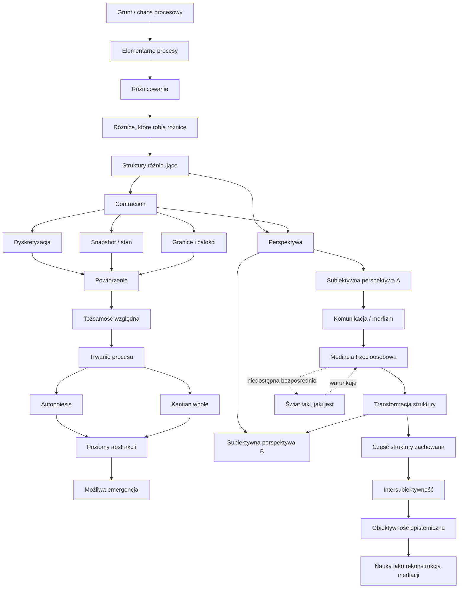
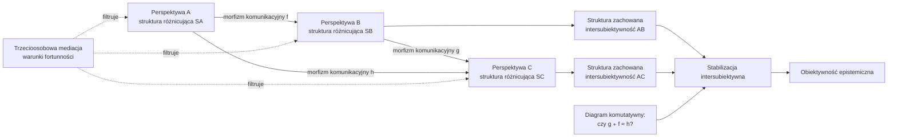

Poniżej porządkuję wszystkie główne pojęcia, które wprowadziłeś, wraz z ich roboczymi definicjami i relacjami. Nie dopisuję nowych tez ponad to, co już się pojawiło — raczej czyszczę i układam aparat pojęciowy.

---

# 1. Poziom najbardziej fundamentalny

## [[Grunt]]
## [[Proces]]

## [[Różnica|Różnicowanie]]

---

# 2. Struktura i znaczenie

## [[Struktury różnicujące]]

## [[Znaczenie]]

## [[Nowość]]

---

# 3. Zmiana, powtórzenie i contraction

## [[Zmiana]]

## [[Stan]]

## [[Powtarzanie]]

## [[Contraction]]

## [[Dyskretyzacja]]

---

# 4. Tożsamość, trwanie, całość

## [[Tożsamość]]

## [[Trwanie]]

## [[Autopoiesis]]

## [[Kantian Whole]]
## Selekcja / [[Darwinizm Procesów]]

## [[Teleologia]]
---

# 5. Poziomy, abstrakcja, superweniencja

## [[Poziom abstrakcji]]*

## Fuzziness / blur

Ponieważ procesy są płynne, granice między poziomami nie są ostre.

Tak jak trudno powiedzieć, kiedy kopiec piasku przestaje być kopcem, tak trudno powiedzieć, kiedy dokładnie kończy się jeden poziom procesu, a zaczyna drugi.

## Emergence / [[Emergencja]]

## [[Superweniencja procesowa]]

---

# 6. [[Czas]]

## [[Przyszłość i przeszłość]]

---

# 7. Perspektywa i świadomość

## [[Perspektywa]]
## [[Subiektywna Perspektywa]]
## [[Świadomość]]

## [[Fenomenologia]]

---

# 8. Trzecioosobowość, intersubiektywność, komunikacja

## [[Świat taki jakim jest]]
## [[Trzecioosobowa perspektywa]]

## [[Komunikacja]]
## [[Intersubiektywność]]

## Obiektywność epistemiczna

**Obiektywność epistemiczna** to stabilizacja intersubiektywnych rezultatów.
Nie jest bezpośrednim dostępem do świata takiego, jaki jest.  
Jest raczej rekonstrukcją warunków mediacji na podstawie tego, co stabilnie przechodzi między perspektywami.
## [[philosophy-writing-okn-tkc/terms/Nauka|Nauka]]

---
# 9. Matematyzacja i teoria kategorii

## [[Morfizm]]
## Diagram komutatywny
**Diagram komutatywny** może modelować sytuację, w której różne ścieżki komunikacji prowadzą do zachowania tej samej struktury.
To byłoby formalne narzędzie opisu stabilnej intersubiektywności.
## Funktor (ChatGPT zaproponował) - nie wiem o co chodzi, może to obiecujące
**Funktor** może opisywać przejście między poziomami opisu, np.
- z fenomenologicznego do językowego,
- z językowego do naukowego,
- z subiektywnego do intersubiektywnego,    
- z lokalnej struktury do bardziej abstrakcyjnej.

## [[Teoria kategorii]]

---

# 10. Możliwa hierarchia pojęć zaproponowana przez ChatGPT

## Pojęcia pierwotne

Najbardziej podstawowe:

1. **proces**
2. **różnicowanie**
3. **relacja**
4. **contraction**
5. **perspektywa**
6. **mediacja**

## Pojęcia wtórne

Wyprowadzane z powyższych:

1. **struktura różnicująca**
2. **stan**
3. **powtórzenie**
4. **tożsamość**
5. **znaczenie**
6. **czas procesowy**
7. **komunikacja**
8. **intersubiektywność**
    
## Pojęcia dalsze / bardziej złożone

1. **autopoiesis**
2. **Kantian whole**
3. **poziomy abstrakcji**
4. **emergencja**
5. **obiektywność epistemiczna**
6. **nauka**
7. **formalizacja kategorialna**

---

# 11. Relacje między pojęciami — wersja strzałkowa

```text
grunt / chaos procesowy
    ↓
elementarne procesy
    ↓
różnicowanie
    ↓
różnice, które robią różnicę
    ↓
struktury różnicujące
    ↓
contraction
    ↓
dyskretyzacja / snapshot / granica / stan
    ↓
powtórzenie
    ↓
tożsamość względna
    ↓
trwanie procesu
    ↓
autopoiesis / Kantian whole
    ↓
poziomy abstrakcji / możliwa emergencja
```

Perspektywy i komunikacja:

```text
struktura różnicująca
    ↓
lokalny dostęp + contraction
    ↓
subiektywna perspektywa

subiektywna perspektywa A
    ↓
komunikacja jako morfizm
    ↓
mediacja trzecioosobowa filtruje transformację
    ↓
subiektywna perspektywa B

część struktury, która przetrwała A → B
    ↓
intersubiektywność

stabilne przetrwanie struktur między wieloma perspektywami
    ↓
obiektywność epistemiczna

systematyczna rekonstrukcja warunków mediacji
    ↓
nauka
```

---

# 12. Mermaid graf



---

# 13. Mermaid graf bardziej kategorialny



---